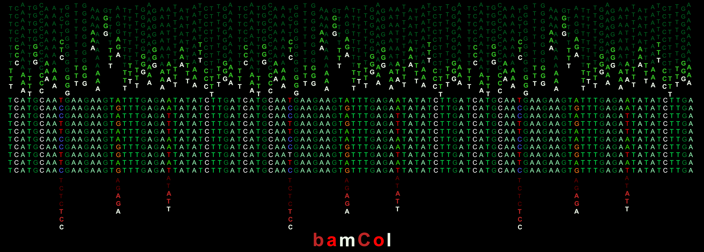

# bamCol.py

_version 0.3.5_



**Extract per-read base calls at specific genomic positions from a BAM file using pysam.**

Given a chromosomal position or positions, `bamCol` extracts base calls from a BAM file of mapped sequence reads. Output is a CSV table listing the read ID, base call, mapping quality, strand, and other information. Positions are automatically divided among available CPU cores for parallel processing.

`bamCol` is useful for inspecting allele composition, verifying variant calls, or extracting read-level evidence at specific coordinates. The output can be used to track SNP outcomes along specific reads, providing evidence for strand exchanges or other chromosomal alterations. By default, only primary alignment reads are returned.

---

## 🔧 Requirements

- Python 3.8+
- [pysam](https://pysam.readthedocs.io/en/latest/)

---

## 📦 Installation

### Option 1: Conda (Recommended)

```bash
conda create -n bamcol python=3.10 pysam -y
conda activate bamcol
git clone <repository-url>
cd bamCol
```

If pysam fails during environment creation, activate the environment and run `pip install pysam`.

### Option 2: Docker

See [Docker Setup](#-docker-setup) at the bottom of this document.

---

## 🚀 Usage

```bash
python bamCol.py <bamfile> [options]
```

**Quick examples:**
```bash
# Single position
python bamCol.py sample.bam --pos S288C_chrI:2941 --out alleles.csv

# Multiple positions
python bamCol.py sample.bam --pos S288C_chrI:2941 --pos S288C_chrI:2947 --out alleles.csv

# Position file
python bamCol.py yeast.bam --pos-file positions.txt --out calls.csv

# VCF input
python bamCol.py sample.bam --vcf-file variants.vcf.gz --out allele_calls.csv

# Pipe to compressed output
python bamCol.py sample.bam --pos-file SK1_SNPs.csv | pigz > output.csv.gz
```

---

## ⚙️ Command Line Options

| Option   | Description |
|----------|-------------|
| **Position Input** *(at least one required)* | |
| `--pos CHR:POS` | 1-based coordinate, e.g. `S288C_chrII:123927`. Repeatable. |
| `--pos-file FILE` | TSV or CSV with `chrom pos` columns (1-based). Lines starting with `#` are ignored. |
| `--vcf-file FILE` | VCF file (.vcf or .vcf.gz). Extracts biallelic SNPs with FILTER=PASS only. |
| **Region Filtering** | |
| `--include-region CHR:START-END` | Restrict to positions within this region (1-based, inclusive). Repeatable. |
| `--exclude-region CHR:START-END` | Drop positions within this region (1-based, inclusive). Repeatable. |
| **Quality Filters** | |
| `--min-mapq N` | Minimum mapping quality (default: `0`). |
| `--min-bq N` | Minimum base quality, Phred (default: `0`). |
| `--max-depth N` | Maximum pileup depth (default: `100000`). |
| **Alignment Options** | |
| `--no-ignore-overlaps` | Count both mates when reads overlap (default: overlaps ignored to prevent double-counting). |
| `--ignore-orphans` | Ignore reads whose mate is not properly paired. |
| `--include-secondary` | Include secondary alignments. |
| `--include-supplementary` | Include supplementary alignments. |
| **Output & Performance** | |
| `--out FILE` | Output CSV file (default: stdout). |
| `--cigar` | Include the CIGAR string in output. |
| `--process N` | Number of worker processes (default: all available CPU cores). |
| `--version` | Show version number and exit. |

---

## 📄 Output Format

Each row represents a **read** overlapping a specified reference position.

| Column | Description |
|--------|-------------|
| `chrom` | Chromosome / reference name. |
| `pos` | 1-based reference position. |
| `read_id` | Read name (query name). |
| `read_pos` | Position on the read aligned to the current reference nucleotide. |
| `call` | Base observed at that position (`A`, `T`, `G`, `C`, `DEL`, `REFSKIP`). |
| `is_del` | `True` if the read has a deletion at this position. |
| `is_refskip` | `True` if the read skips this reference position (e.g. spliced RNA-seq). |
| `base_qual` | Phred base quality score. |
| `mapq` | Read mapping quality. |
| `strand` | `+` or `-`. |
| `cigar` | *(Optional)* CIGAR string, only if `--cigar` is used. |
| `flag` | SAM bitwise flag. |

---

## 📝 Input File Formats

### Position File

Tab or comma-separated, with `chrom` and `pos` columns (1-based). Lines starting with `#` are treated as comments; a header line is not required.

```
#chrom,pos
S288C_chrI,2941
S288C_chrI,2947
S288C_chrII,123927
```

### VCF File

Standard VCF 4.x, compressed (`.vcf.gz`) or uncompressed (`.vcf`). Only biallelic SNPs with FILTER=PASS are extracted — indels, multi-allelic sites, and non-PASS variants are skipped.

```
##fileformat=VCFv4.2
#CHROM	POS	ID	REF	ALT	QUAL	FILTER	INFO
chr1	1000	.	A	G	30	PASS	DP=50
chr1	2000	.	C	T	35	PASS	DP=55
```

---

## 🧪 Testing the Installation

```bash
python make_example_data.py
python bamCol.py example_data/example.bam --pos-file example_data/positions.txt
```

The `make_example_data.py` script creates an `example_data/` folder with a small BAM file, index, positions file, and example VCF files.

**Expected output:**

| chrom | pos | read_id | read_pos | call | is_del | is_refskip | base_qual | mapq | strand | flag |
|-------|-----|---------|----------|------|--------|------------|-----------|------|--------|------|
| S288C_chrI | 1000 | read_001 | 20 | A | False | False | 40 | 60 | + | 99 |
| S288C_chrI | 1500 | read_002 | 20 | C | False | False | 39 | 59 | - | 147 |
| S288C_chrI | 2000 | read_003 | 20 | G | False | False | 41 | 58 | - | 83 |

Additional tests:
```bash
python bamCol.py example_data/example.bam --vcf-file example_data/example.vcf

python bamCol.py example_data/example.bam \
    --vcf-file example_data/example.vcf \
    --exclude-region S288C_chrI:1400-1600

# Error handling with malformed VCF
python bamCol.py example_data/example.bam --vcf-file example_data/malformed.vcf
```

---

## 📊 Typical Workflow

```bash
# 0) Map reads to reference
minimap2 -ax asm5 ref_genome.fasta diverged_genome_reads.fastq.gz \
  | samtools view -b -q 50 \
  | samtools sort \
  > sample.bam
samtools index sample.bam

# 1) Call variants with bcftools
bcftools mpileup -Ou -f reference_genome.fa sample.bam \
  | bcftools call -mv -Oz -o sample.vcf.gz
bcftools index sample.vcf.gz

# 2) Extract per-read base calls at variant sites
python bamCol.py sample.bam \
  --vcf-file sample.vcf.gz \
  --out allele_calls.csv
```

For complex filtering, pre-filter the VCF with `bcftools` before passing it to `bamCol`:

```bash
bcftools view -T regions.bed sample.vcf.gz -O z -o filtered.vcf.gz
python bamCol.py sample.bam --vcf-file filtered.vcf.gz --out allele_calls.csv
```

---

## 🔬 VCF SNP Pre-filtering Helper (`vcf_filt.R`)

An auxiliary R script is included for more stringent SNP pre-filtering than `--vcf-file` provides. It applies: biallelic SNP selection, minimum QUAL threshold, depth filtering relative to median INFO/DP, AC=2 (homozygous ALT) selection, and optional chromosome exclusion (e.g. mitochondrial DNA). Output is a filtered VCF and/or a CHROM/POS coordinate list for use with `--pos-file`.

**Required R packages:** `tidyverse`, `vcfR`, `optparse` (all on CRAN).

> With `--vcf-file` support added in v0.3.0, many users can skip this step. `vcf_filt.R` remains useful when you need custom filtering beyond biallelic PASS SNPs.

---

## 🧠 Notes

- Requires an indexed BAM (`.bam.bai`).
- For large datasets, use `--max-depth` to control memory use.
- For large outputs, pipe into `gzip` or `pigz`.
- Region filtering is optimized for 1–10 regions. For more complex filtering, pre-filter your VCF with `bcftools`.

---

## 🔄 Version History

**v0.3.4** - Added progress bar if user has `tqdm` installed.
`tqdm` can be installed via homebrew

**v0.3.3** - Added `--adjust-hardclip` to account for hard clipped sequences
when calculating `read_position` in output. Useful for analyses that use
supplementary alignments.

**v0.3.2** — Added `--include-region` / `--exclude-region` with performance warning for >10 regions and region filtering statistics in logs.

**v0.3.1** — Improved error handling for malformed VCF and position files; better warnings throughout.

**v0.3.0** — Added `--vcf-file` with automatic biallelic PASS SNP filtering, bgzip/gzip VCF support, and position deduplication.

**v0.2.1** — Multiprocessing (`--process`), `read_pos` column, `--cigar` flag, `--include-secondary`, `--include-supplementary`, version tracking.

---

## 🐳 Docker Setup

Docker provides an isolated environment without managing Python dependencies directly.

### Building the Image

```bash
docker build -t bamcol:0.3.2 .
```

The included `Dockerfile` for reference:

```dockerfile
FROM python:3.10-slim

RUN apt-get update && apt-get install -y \
    gcc libbz2-dev liblzma-dev zlib1g-dev libcurl4-openssl-dev \
    && rm -rf /var/lib/apt/lists/*

RUN pip install --no-cache-dir pysam

WORKDIR /app
COPY bamCol.py /app/
ENTRYPOINT ["python", "/app/bamCol.py"]
```

### Running with Docker

All file paths inside the container must be relative to the mounted directory. Mount your local data directory to `/data`:

```bash
docker run --rm -v /path/to/data:/data bamcol:0.3.2 \
    /data/sample.bam --pos chr1:1000 --out /data/results.csv
```

Create an alias for convenience:
```bash
# Add to ~/.bashrc or ~/.zshrc
alias bamcol='docker run --rm -v $(pwd):/data bamcol:0.3.2'

# Then use like a normal command
bamcol /data/sample.bam --pos chr1:1000 --out /data/results.csv
```

### Testing the Docker Installation

```bash
# Create example data
docker run --rm -v $(pwd):/data -w /data python:3.10-slim \
    bash -c "pip install pysam && python /data/make_example_data.py"

# Run bamCol
docker run --rm -v $(pwd):/data bamcol:0.3.2 \
    /data/example_data/example.bam \
    --pos-file /data/example_data/positions.txt
```

---

## 🪪 License

MIT License © 2025 Robert J. D. Reid  
Contributions welcome.
